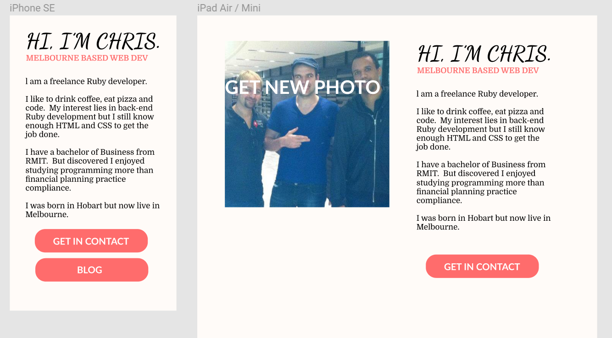
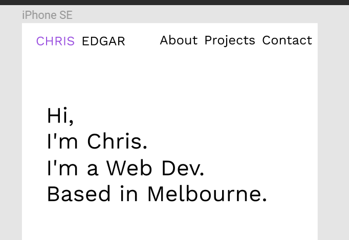

# ChrisEdgar.com
* My portfolio site I designed simply.  Because this is the first project I didn't want to add lot's of advanced features just for the sake of it.  I focused on the cookie cutter basics but tried to do them well.  Focusing on spacing and fonts. *

# Contents
	-1. Demonstrate your understanding of your site's audience
	-2. Demonstrate the design decisions made
	-3. Demonstrate that you considered usability heuristics
	-4. Any wireframes
	-5. Style guide
	-6. Personal Logo

# 1. Demonstrate your understanding of your site's audience

I built my site around the target audience of potential employers.  To do this I tried to think about what potential employers would use the site for.  Primarily it would be to find contact information and also to get insights into my persona, skills and capabilities.  To do this I made sure all the required information that they needed was easilly available.

# 2. Demonstrate the design decisions made

I decided that I wanted a simple website but with enough features and style to show that I was still competent at HTML and CSS.  I feel that a lot of beginner web designs will add features into their site even when not necessary just to show off their skills but destroying the cohesion of the site.  But the spacing and typography was tested thoroughly.

One of the design decisions made was how to use the 

Another design decision was whether to use a single page or multi-page site.  I decided that it would be better to go for a single page site because it kept in-line with my minimal style.  There also wasn't a lot of content so having it all the one page helped fill out the page.

# 3. Demonstrate that you considered usability heuristics

When the user submits the contact form.  It takes them to another page so that they know their form has been submitted.

The site is simple without unnecessary features that might confuse the user.

To make it easier for the use I included a navigation bar at the top of the page.  Even though the user could just scroll down to the section of the page that they wanted to access the navigation bar was still included incase the user didn't realize that he could scroll down.

# 4. Any wireframes

-  

-  

# 5. Style guide

 My site has a very simple colour scheme.

# 6. Personal Logo

Because the site was designed minimally no design logo was used.  However I made a couple of mock-up logos to meet the documentation criteria.

-  
